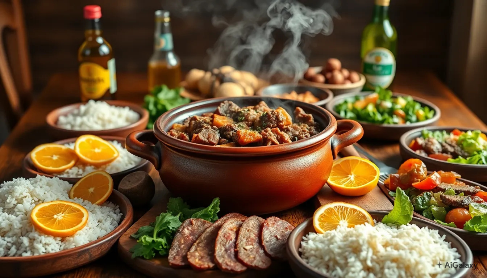

<p align="center">
  
</p>

<h1 align="center">🇧🇷 Brasil à Mesa</h1>

<p align="center">
  Catálogo interativo de receitas brasileiras por região
</p>

<p align="center">
  <strong>Autor:</strong> Leonardo Schiavinatto da Silva
</p>

<p align="center">
  <a href="https://leoschiavinatto.github.io/brasil-a-mesa/">
    🔗 Acessar aplicação (GitHub Pages)
  </a>
</p>

<p align="center">
  
  
  
  
</p>

---

## 🇧🇷 Brasil à Mesa

**Brasil à Mesa** é um catálogo interativo de receitas brasileiras organizado por região, valorizando a diversidade da culinária nacional.

O projeto foi desenvolvido individualmente para as disciplinas de Extensão da UniFil, com foco em:

- Experiência de uso simples e intuitiva
- Exploração da cultura gastronômica regional
- Boas práticas em desenvolvimento web front-end

---

## 🎯 Visão Geral

A aplicação funciona **100% no navegador**, sem backend, utilizando **LocalStorage** para persistência de dados.

Com ela, é possível:

- Explorar receitas por região do Brasil  
- Buscar por nome, ingrediente ou categoria  
- Criar, editar e excluir receitas (CRUD completo)  
- Salvar e acessar favoritos  
- Ler o preparo completo em um diálogo dedicado (com quebra de linha real e botão de “copiar preparo”)  
- Alternar entre **tema claro e escuro**  
- Navegar por páginas de **Histórias** e **Sobre**, com conteúdo cultural contextualizado  
- Ver estatísticas locais no **Perfil** (quantidade de receitas e favoritos) e limpar todos os dados salvos no navegador  

---

## 👨‍💻 Desenvolvedor

**Leonardo Schiavinatto da Silva**  
Responsável por:

- Modelagem
- Implementação
- Estilização
- Testes
- Publicação (GitHub Pages e Oracle Cloud)

---

## 🧩 Funcionalidades

### 📌 Página Inicial
- Hero em tela com imagem temática e chamada principal
- Chamada para explorar receitas com foco em navegação simples

### 📌 Receitas
- Busca dinâmica por:
  - Nome
  - Ingredientes
  - Categoria
- Filtro por região (Norte, Nordeste, Centro-Oeste, Sudeste, Sul)
- Marcar/desmarcar como favorito (★)
- Criar, editar e excluir receitas
- Exibição de resumo do preparo no card
- Leitura do preparo completo em diálogo com:
  - Quebra de linha real (`white-space: pre-wrap`)
  - Botão de copiar texto para a área de transferência

### 📌 Regiões
- Navegação por região:
  - Norte
  - Nordeste
  - Centro-Oeste
  - Sudeste
  - Sul
- Lista de receitas automaticamente filtradas pela região selecionada

### 📌 Histórias
- Textos originais sobre a cultura gastronômica de cada região
- Enfoque em contexto cultural, tradições e hábitos alimentares

### 📌 Sobre
- Explicação do propósito do projeto
- Impacto cultural e motivação
- Tecnologias utilizadas e contexto acadêmico

### 📌 Perfil Local
- Exibição de estatísticas:
  - Quantidade total de receitas
  - Quantidade de receitas salvas como favoritas
- Opção de limpar totalmente os dados armazenados no navegador (reset do LocalStorage)

### 🌗 Tema Claro/Escuro
- Alternância entre tema **escuro** e **claro** via botão no topo
- Preferência de tema salva em `localStorage` (`brasil_a_mesa_theme`)
- Aplicação automática do tema escolhido na próxima visita

---

## 🛠 Tecnologias Utilizadas

- **HTML5**
  - Estrutura semântica
  - SPA simples por hash (`#inicio`, `#receitas`, etc.)

- **CSS3**
  - Tema “Brasil à Mesa” (cores, tipografia, hero, grid)
  - Layout responsivo (mobile/desktop)
  - Estilização de cards, dialogs e toolbar
  - Variáveis CSS para facilitar tema claro/escuro

- **JavaScript (ES6+)**
  - CRUD completo em memória + LocalStorage
  - Filtros, buscas e favoritos
  - Diálogos de leitura e edição
  - Navegação tipo SPA por hash
  - Manipulação de DOM sem frameworks

- **Armazenamento**
  - `localStorage` para:
    - Base de receitas (`receitas_v3`)
    - Favoritos (`receitas_favs_v1`)
    - Tema selecionado (`brasil_a_mesa_theme`)

- **Outras tecnologias**
  - JSON (base inicial de receitas)
  - Git + GitHub (versionamento)
  - GitHub Pages (deploy estático)
  - Oracle Cloud (VM com Nginx para hospedagem opcional)

---

## 📁 Estrutura do Projeto

```bash
brasil-a-mesa/
│
├── index.html       # Estrutura principal da SPA
├── styles.css       # Estilos globais, tema, layout e componentes
├── app.js           # Lógica da aplicação (CRUD, filtros, navegação)
│
├── data/
│   └── receitas.json  # Base inicial de receitas
│
└── assets/
    └── hero.jpg       # Imagem principal do hero
🧪 Como Executar Localmente
Método rápido (sem servidor)
Clone ou baixe o repositório

Abra o arquivo index.html diretamente no navegador

Alguns navegadores podem bloquear o fetch do receitas.json via file://.
Nesse caso, use um servidor local (abaixo).

Método recomendado (servidor local)
Com Node.js
bash
Copiar código
npx serve .
# ou
npx http-server .
Depois, acesse:

text
Copiar código
http://localhost:3000
# ou a porta exibida pelo comando
Com Python (3.x)
bash
Copiar código
python -m http.server 5500
# Acesse:
# http://localhost:5500
🌐 Publicações
🔵 GitHub Pages
A aplicação está disponível publicamente em:

https://leoschiavinatto.github.io/brasil-a-mesa/

🟧 Oracle Cloud
Aplicação também pode ser hospedada em uma VM na Oracle Cloud, com:

Servidor Nginx configurado para servir o conteúdo estático do projeto

Deploy via git clone ou cópia dos arquivos para o diretório raiz do servidor

IP público: (substituir pelo IP público da instância quando configurado)

📊 Diagramas UML
A modelagem do sistema foi documentada usando diagramas UML, contemplando casos de uso e sequência.

Diagrama de Casos de Uso
mermaid
Copiar código
graph LR
  U[«Ator» Usuário]

  subgraph S[Sistema: Brasil à Mesa]
    UC1(Listar receitas)
    UC2(Buscar / Filtrar receitas)
    UC3(Criar receita)
    UC4(Editar receita)
    UC5(Excluir receita)
    UC6(Favoritar receita)
    UC7(Ver preparo completo)
  end

  U --> UC1
  U --> UC2
  U --> UC3
  U --> UC4
  U --> UC5
  U --> UC6
  U --> UC7
Este diagrama representa as principais interações do usuário com o sistema.

Diagrama de Sequência — Carregamento e Criação
mermaid
Copiar código
sequenceDiagram
  actor U as Usuário
  participant UI as Interface
  participant LS as localStorage
  participant JSON as data/receitas.json

  U->>UI: Acessa aplicação
  UI->>LS: getItem(KEY)
  alt Base encontrada
    LS-->>UI: Retorna base
    UI->>UI: Renderiza lista
  else Base ausente
    LS-->>UI: null
    UI->>JSON: fetch receitas.json
    JSON-->>UI: Base inicial
    UI->>LS: setItem(KEY)
    UI->>UI: Renderiza lista inicial
  end

  U->>UI: Criar receita
  UI->>LS: Atualiza base
  UI->>UI: Atualiza lista
Este diagrama mostra:

Fluxo de inicialização da aplicação

Leitura do localStorage

Fallback para o arquivo receitas.json

Atualização da base ao criar novas receitas

🔄 Fluxo de Atualização do Projeto
Para atualizar o projeto e refletir mudanças no GitHub Pages:

bash
Copiar código
git add .
git commit -m "README atualizado + melhorias gerais"
git push origin main
📝 Licença
Projeto desenvolvido com finalidade educacional e acadêmica.
Pode ser utilizado como referência para estudos em:

Desenvolvimento web front-end

SPA simples sem frameworks

Uso de LocalStorage

Documentação com UML