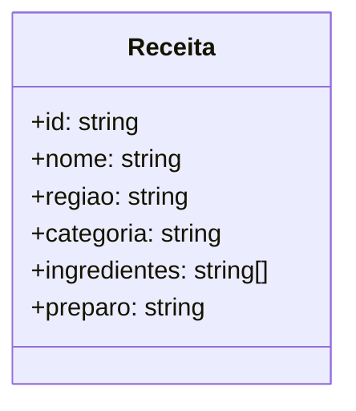
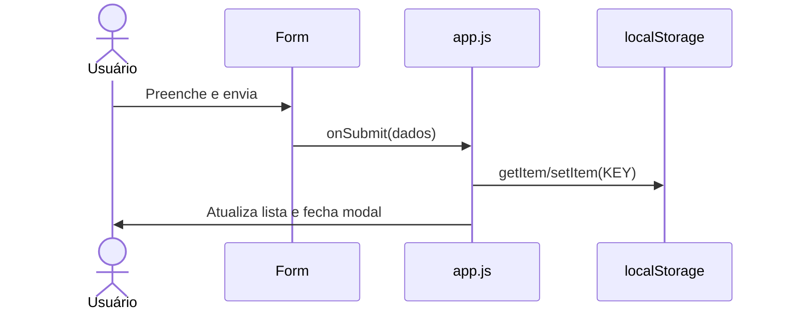

# Biblioteca de Receitas Regionais

App estático 100% local. Sem requisições externas. Publicável no GitHub Pages, Firebase Hosting ou Oracle OCI.

## Rodar local
```bash
python -m http.server 5500
# http://localhost:5500
```

## Diagramas (Mermaid)
### Caso de Uso
```mermaid
usecase
  actor Usuario
  Usuario --> (Cadastrar receita)
  Usuario --> (Listar receitas)
  Usuario --> (Editar/Excluir)
  Usuario --> (Buscar/Filtrar)
```

### Classes


### Sequência: salvar receita

